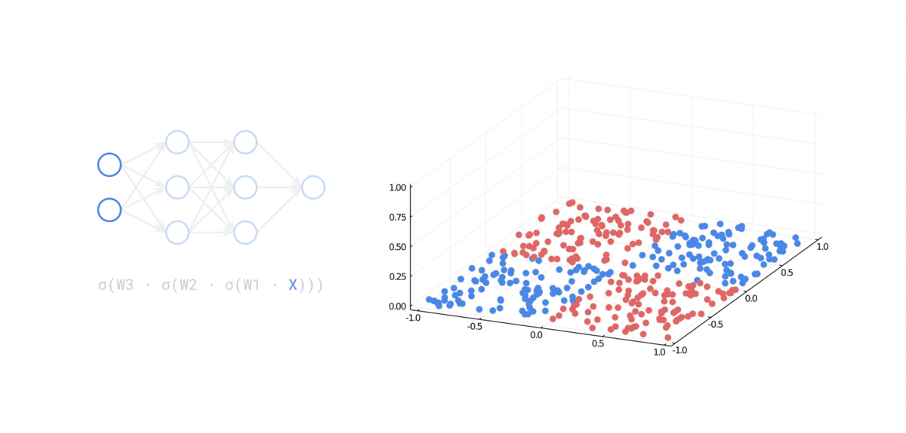
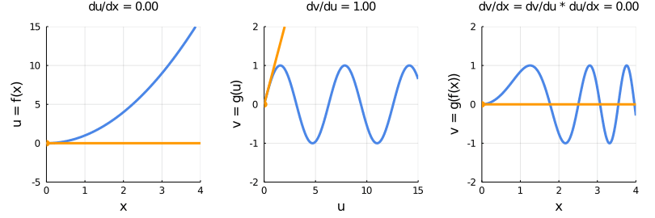

# The Feynman Journal

This repository contains the source code for visualizations in [The Feynman Journal](https://medium.com/the-feynman-journal). One such visualization is the following, which shows how a neural network separates data using nonlinear activations:

Here's another visualization, which demonstrates how the chain rule works:

Most of the code is written in [Julia](https://julialang.org/) notebooks, as Julia is ideal for creating informative animations.
